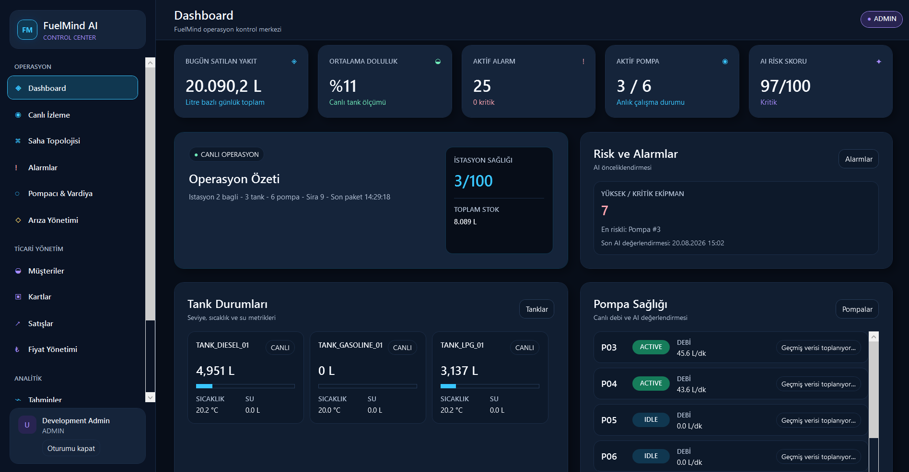
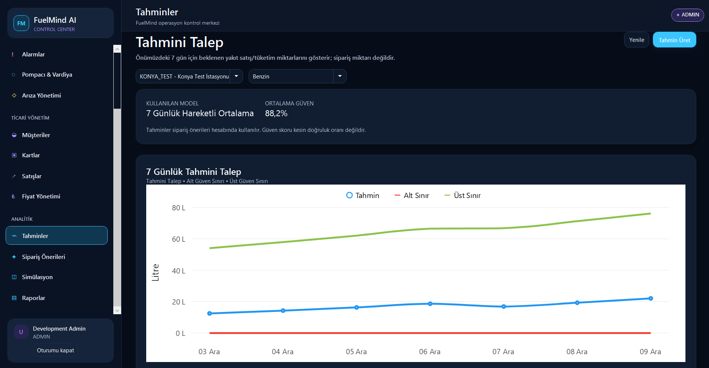
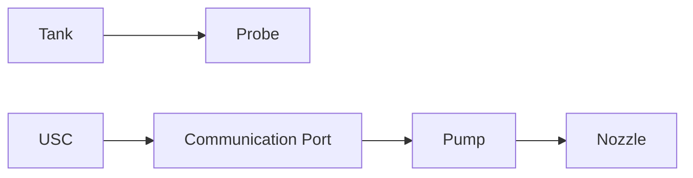
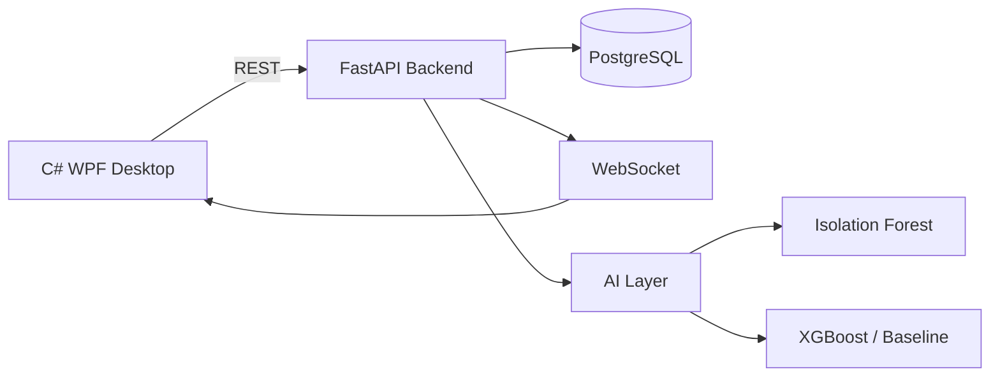
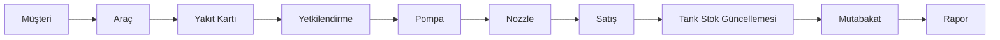

# FuelMind AI

## Yapay Zekâ Destekli Akaryakıt İstasyonu İzleme, Anomali Tespiti ve Akıllı Stok Planlama Sistemi

FuelMind AI; akaryakıt istasyonlarında tank, probe, USC, communication port, pompa ve nozzle gibi saha bileşenlerini izleyen; gerçek saha verisi bulunmadığında aynı operasyon akışını simülasyonla üretebilen; satış, müşteri, araç, yakıt kartı, alarm, arıza, anomali tespiti, talep tahmini, stok planlama ve raporlama süreçlerini tek platformda birleştiren C# WPF tabanlı endüstriyel karar destek prototipidir.

> **Geliştirici:** Ebru Sena Özsöğüt

Bu çalışma, saha cihazlarına bağlanacak bir üretim ürününün veri, servis ve kullanıcı arayüzü katmanlarını; kontrollü test verisi ve deterministik simülasyonla doğrulanabilir biçimde modellemeyi amaçlar.

## Uygulamadan Görüntüler

### Dashboard



İstasyonun operasyonel durumunu tek ekranda özetler. Tank, pompa, satış, alarm ve kritik sistem göstergeleri yöneticiye hızlı durum farkındalığı sağlar.

### Alarm Yönetimi


Kural tabanlı veya yapay zekâ destekli tespitlerden oluşan alarm kayıtları merkezi olarak izlenir. Alarm durumu, kaynak cihaz, önem seviyesi ve ilgili operasyon bilgileri bu ekran üzerinden takip edilir. Alarm bir olay veya anormallik kaydıdır; fault ise doğrulanmış teknik arızanın yaşam döngüsünü temsil eder.

### Satış Yönetimi


Gerçekleşen satış işlemleri istasyon, pompa, nozzle, yakıt türü, müşteri, araç, yakıt kartı, pompacı, vardiya, totalizer ve fiyat snapshot bilgileriyle birlikte izlenir. `start_totalizer + quantity = end_totalizer`; sonraki satışta önceki satışın bitiş totalizer değeri başlangıç değeri olur.

### Talep Tahmini



Geçmiş tamamlanmış satışlar kullanılarak istasyon ve yakıt türü bazında önümüzdeki 7 günlük beklenen talep hesaplanır.

> **Tahmini talep**, gelecekte satılması beklenen yakıt miktarıdır. **Sipariş önerisi** ise tahmini talep, mevcut stok ve minimum güvenli stok birlikte değerlendirilerek üretilen satın alma önerisidir.

## Ana Özellikler

### Canlı izleme ve saha topolojisi

- Tank seviyeleri, pompa durumları, probe ölçümleri, USC/port durumları ve nozzle durumları izlenir.
- REST API ve WebSocket yayını ile masaüstü istemciye canlı güncellemeler iletilir.
- Saha ilişkileri fiziksel ve haberleşme katmanları ayrıştırılarak modellenir:



Probe, tank içindeki yakıt yüksekliği, hacmi, sıcaklığı ve su seviyesi gibi fiziksel ölçümleri temsil eder. Communication Port yakıt hattı değildir; saha cihazlarının haberleşme kanalıdır.

### Ticari operasyonlar

- Müşteri, filo/grup, araç, sürücü, yakıt kartı, limit, ödeme tipi ve settlement type yönetimi
- Yakıt kartı ile aktiflik, geçerlilik tarihi, istasyon, yakıt türü, araç, gün/saat ile tek işlem, günlük ve aylık limit kontrolleri
- Attendant, shift ve assignment ilişkileri ile gece vardiyası desteği
- Tarihçeli yakıt fiyatı ve satış anında değişmez `sale_price_snapshot`
- Totalizer sürekliliği, stok mutabakatı, alarm/fault yönetimi ve denetim izi

### Karar destek

- Kural tabanlı kontroller, Isolation Forest ve veri kalite kontrolleriyle hibrit anomali kararı
- Baseline ve XGBoost ile 7 günlük talep tahmini
- Kritik stok tarihi, önerilen sipariş tarihi ve sipariş miktarı hesaplama
- Gün sonu, satış, pompacı/vardiya, dolum, tank ölçüm, fiyat değişimi, fault ve müşteri/araç satış raporları; PDF ve CSV dışa aktarma

## Sistem Mimarisi



Backend, iş kurallarını, veri erişimini, simülasyon ve model servislerini yürütür. WPF istemcisi REST ile işlem yapar, WebSocket üzerinden güncel istasyon olaylarını alır. Örnek canlı yayın uç noktası: `/api/ws/stations/{station_id}/live`.

## Simülasyon Motoru

Simülasyon yalnızca rastgele sayı üretmez. İstasyonun tank, pompa ve aktif satış durumunu kendi state'i içinde tutar ve her tick'te bu durumu ilerletir.

- **Stateful ve tick-based:** aktif satış state'i, tank state'i, pump state'i, delivery ve sensor reading'leri birbirini etkileyen operasyon akışında ilerler.
- **Deterministik seed:** aynı başlangıç koşulu ve seed, tekrarlanabilir senaryo ve veri üretimi sağlar.
- **SimulationClock:** gerçek zamandan bağımsız, hızlandırılabilir sanal zamanı yönetir.
- **Dataset üretimi:** gerçek cihaz verisi olmadan 30/60/90 günlük kontrollü satış ve sensör veri kümeleri üretilebilir.
- **Operasyon olayları:** satış başlatma/tamamlama, tank tüketimi, delivery ve cihaz ölçümleri tick döngüsünde işlenir.

### Senaryo ve arıza simülasyonu

Simülasyon; düşük pompa debisi, yüksek motor akımı, sensör takılması, ani sensör sıçraması, tank/satış uyuşmazlığı, su seviyesi yükselmesi, ani talep artışı, port communication failure, USC initialization error, probe communication error ve pump not connected gibi örnekleri kapsar.

Geçici saha arızası sona erdiğinde cihaz kör biçimde `ACTIVE` durumuna alınmaz; senaryo öncesindeki gerçek durum geri yüklenir.

## Yapay Zekâ Destekli Anomali Tespiti

```text
Kural tabanlı sistem + Isolation Forest + veri kalite kontrolleri = hibrit anomali kararı
```

Kural tabanlı katman açıklanabilir operasyonel eşikleri kontrol eder. Isolation Forest, etiketli arıza verisine ihtiyaç duymadan normal davranış örüntüsünden sapmaları bulmak için kullanılır. Veri kalite katmanı ise eksik, takılı veya tutarsız ölçümleri ayrı bir sinyal olarak değerlendirir.

Risk skoru bir arıza olasılığı değildir; gözlenen davranışın normal referans davranıştan sapma derecesidir. Bu nedenle tek başına teknik arıza kararı yerine alarm önceliklendirme ve araştırma girdisi olarak kullanılır.

## Alarm ve Fault Yönetimi

| Kavram | Anlamı |
|---|---|
| Alarm | Sistemin gözlemlediği anormallik veya operasyonel olay |
| Fault | Doğrulanmış teknik arıza kaydı |

Fault yaşam döngüsü `OPEN → INVESTIGATING → RESOLVED` şeklindedir. Alarm, operatörün incelemesi veya otomatik iş kuralı ile fault kaydına dönüştürülebilir; her alarm otomatik olarak doğrulanmış arıza sayılmaz.

## Ticari Satış Akışı



Satış öncesi yakıt kartının aktif/pasif durumu, geçerlilik tarihi, istasyon ve yakıt türü yetkisi, bağlı araç, gün/saat kısıtları ile tek işlem, günlük ve aylık limitleri değerlendirilir. Başarılı satış, stok hareketi, totalizer, raporlama ve mutabakat zincirinin kaynağıdır.

### Totalizer

```text
quantity_liters = end_totalizer_liters - start_totalizer_liters
next start_totalizer = previous end_totalizer
```

Bu ilişki, kayıtlı litre miktarının fiziksel sayaç hareketiyle tutarlı olmasını sağlar.

### Tank–satış mutabakatı

Gerçekleşen satışların tank stok hareketi ile tutarlı olup olmadığı mutabakat servisi üzerinden kontrol edilir. Açıklanamayan fark, `TANK_SALES_MISMATCH` alarmı oluşturabilir; olası sızıntı, ölçüm sorunu veya kayıt tutarsızlığı araştırılır.

### Fiyat, pompacı ve vardiya

Yakıt fiyatı değişiklikleri tarihçeli tutulur. Satış kaydı, daha sonra fiyat değişse bile satış anındaki `sale_price_snapshot` değerini korur. Attendant ve shift assignment bilgileri de satışla ilişkilendirilir; bu yapı pompacı/vardiya bazlı izlenebilirlik ve gece vardiyası desteği sağlar.

## 7 Günlük Talep Tahmini

```text
Tamamlanmış geçmiş satışlar → günlük agregasyon → lag / rolling features → Baseline / XGBoost → 7 günlük talep tahmini
```

Baseline model `seven_day_moving_average` yaklaşımını kullanır. Ana aday model `XGBoost Regressor`dır; model karşılaştırmasında MAE, RMSE ve MAPE metrikleri kullanılır. Seçilen model, doğrulama performansına göre belirlenir.

Tahmin güven değeri kesin doğruluk yüzdesi değildir. Model belirsizliğini kullanıcıya daha anlaşılır göstermek için kullanılan bir güven göstergesidir.

## Stok Planlama ve Sipariş Önerisi

Forecast, gelecekte beklenen tüketimi ifade eder; order recommendation ise satın alma eylemi için hesaplanır. Planlama servisi mevcut stok, tahmini talep, safety stock ve minimum safe stock verilerini bir araya getirerek kritik stok tarihi, önerilen sipariş tarihi ve önerilen sipariş miktarını üretir. Bu nedenle tahmin ekranındaki litre değeri doğrudan sipariş miktarı değildir.

## Raporlama

Raporlama modülü gün sonu, satış, pompacı/vardiya, dolum, tank ölçüm, fiyat değişimi, fault ve müşteri/araç satış raporlarını kapsar. Tarih, saat, istasyon, pompa, nozzle, yakıt, müşteri, plaka, pompacı ve vardiya filtreleri kullanılabilir. Çıktılar PDF veya CSV olarak alınır; Türkçe karakter desteği hedeflenir.

## Teknolojiler

| Katman | Teknolojiler |
|---|---|
| Desktop | C#, .NET 8, WPF, MVVM, CommunityToolkit.Mvvm, LiveCharts2, HttpClient, ClientWebSocket |
| Backend ve API | Python, FastAPI, REST, WebSocket, SQLAlchemy, Alembic, PostgreSQL, Uvicorn |
| AI ve raporlama | Isolation Forest, XGBoost, ReportLab, CSV dışa aktarma |

Ana masaüstü ekranları: Dashboard, Canlı İzleme, Saha Topolojisi, Alarmlar, Arıza Yönetimi, Pompacı & Vardiya, Müşteriler, Kartlar, Satışlar, Fiyat Yönetimi, Tahmin, Sipariş Önerileri, Raporlar ve Model Yönetimi.

## Final Demo Verisi

Final demo seed'i ile aşağıdaki doğrulama envanteri kullanılır:

| Varlık | Adet |
|---|---:|
| Station | 1 |
| Fuel Types | 3 |
| Tanks | 3 |
| USC / Controller | 1 |
| Ports | 3 |
| Pumps | 6 |
| Nozzles | 6 |
| Probes | 3 |
| Vehicles | 4 |
| Fuel Cards | 3 |
| Attendants | 6 |
| Shifts | 3 |
| Sales | 42 |
| Deliveries | 3 |
| Forecasts | 21 |

`seed_demo.py` idempotenttir: istasyonu, saha topolojisini, kullanıcıları, müşteri/kart ilişkilerini, fiyat geçmişini, satışları, dolumları ve üç yakıt için forecast kayıtlarını aynı demo işaretleriyle yeniden kullanır. 90 günlük dataset üretimi demo seed'den ayrı bir geliştirme/dataset işlemidir.

## Kurulum ve Çalıştırma (Windows / PowerShell)

Ön koşullar: PostgreSQL, Python 3 ve .NET 8 SDK. `.env` içindeki PostgreSQL bağlantısını yerel veritabanınıza göre düzenleyin.

### Backend

```powershell
cd backend
python -m venv .venv
.\.venv\Scripts\Activate.ps1
python -m pip install --upgrade pip
pip install -r requirements.txt
Copy-Item .env.example .env
.\.venv\Scripts\alembic.exe upgrade head
python -m scripts.seed_demo
python -m uvicorn app.main:app --host 127.0.0.1 --port 8000
```

Yerel demo için `ENABLE_DEMO_USERS=true` bırakın. Aktif simülasyon durumu süreç belleğinde olduğundan tek worker kullanılmalıdır. Swagger: <http://127.0.0.1:8000/docs>.

### Yerel demo girişleri

| Kullanıcı | Rol | Varsayılan Yerel Parola |
|---|---|---|
| `admin` | ADMIN | `fuelmind-demo-admin` |
| `operator` | OPERATOR | `fuelmind-demo-operator` |

Bu bilgiler yalnızca local/demo kullanımı içindir; demo ortamı dışında değiştirin.

### Desktop

```powershell
cd desktop
dotnet restore .\FuelMind.sln
dotnet build .\FuelMind.sln
dotnet run --project .\FuelMind.Desktop\FuelMind.Desktop.csproj
```

Varsayılan API ve WebSocket adresleri `desktop/FuelMind.Desktop/appsettings.json` içindedir.

### Publish

```powershell
dotnet publish .\FuelMind.Desktop\FuelMind.Desktop.csproj -c Release -r win-x64 --self-contained false -o .\artifacts\publish\win-x64
```

Çıktıdaki çalıştırılabilir dosya `desktop/artifacts/publish/win-x64/FuelMind.Desktop.exe` olur. Publish çıktıları Git tarafından ignore edilir.

## Test ve Doğrulama

Son final doğrulama sonuçları:

| Kontrol | Sonuç |
|---|---|
| Backend tests | 500 passed |
| Desktop tests | 87 passed |
| Ruff | PASS |
| Debug build | PASS |
| Release build | PASS |
| Alembic | single head |
| Card → Sale | PASS |
| Sale → Stock | PASS |
| Sale → Totalizer | PASS |
| Sale → Reconciliation | PASS |
| Sale → Report → PDF | PASS |
| Sale → Forecast → Order | PASS |
| Simulation → Alarm | PASS |
| Alarm → Fault | PASS |

Doğrulamayı yerelde yeniden çalıştırmak için:

```powershell
cd backend
.\.venv\Scripts\python.exe -m pytest
.\.venv\Scripts\ruff.exe check .
.\.venv\Scripts\alembic.exe heads
cd ..\desktop
dotnet test FuelMind.sln --no-restore
dotnet build FuelMind.sln -c Release --no-restore
```

## Proje Yapısı

```text
backend/         FastAPI, migrations, seed, simülasyon ve testler
desktop/         WPF uygulaması ve test çözümü
docs/            Tasarım, teknik dokümantasyon ve ekran görüntüleri
data/            Kontrollü veri girdileri
trained_models/  Yerel model artifact kökü
reports/         Yerel üretilen rapor çıktıları
```

## Sınırlar

FuelMind AI bu sürümde gerçek RS-485 / USC saha cihazlarına bağlı çalışan üretim sistemi değildir. Gerçek cihaz entegrasyonuna uygun veri modeli, servis yapısı ve UI katmanı bulunan; simülasyon ve kontrollü test verileriyle doğrulanmış endüstriyel karar destek prototipidir.

## Gelecek Geliştirmeler

- Gerçek saha cihazı entegrasyonu ve RS-485 / serial adapter
- Gerçek USC protocol adapter, probe driver ve pump controller adapter
- Production authentication hardening
- Cloud/central monitoring
- Daha büyük gerçek satış datasetleriyle model retraining
